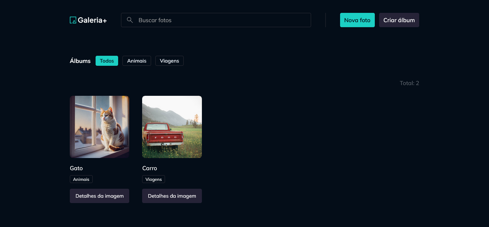

# Gallery Plus



## O que é o Projeto?

Gallery Plus é uma aplicação web moderna projetada para gerenciar e exibir álbuns de fotos. Ela oferece uma interface intuitiva para os usuários fazerem upload, organizarem e visualizarem suas fotos de forma eficiente.

## Tecnologias Utilizadas

- **Frontend**: React, TypeScript, TailwindCSS
- **Backend**: Fastify, TypeScript
- **Ferramentas de Build**: Vite, tsup

## Bibliotecas React Utilizadas

- `@hookform/resolvers`
- `@radix-ui/react-dialog`
- `@tanstack/react-query`
- `react`
- `react-dom`
- `react-hook-form`
- `react-router`
- `sonner`
- `tailwind-variants`
- `zod`

## Como Rodar Localmente

1. Instale as dependências:

   ```bash
   pnpm install
   ```

2. Inicie o servidor backend:

   ```bash
   pnpm dev-server
   ```

3. Em outro terminal, inicie o servidor frontend:
   ```bash
   pnpm dev
   ```
